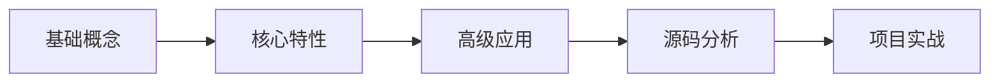

# 🚀 [技术栈名称] 深度学习笔记

## 📋 学习路线图



### 🎯 当前阶段：[学习阶段]

### ⏰ 预计完成时间：[时间]

---

## 🧠 知识体系

### Level 1: 基础概念

- [ ] **概念 1** - 重要度: ⭐⭐⭐⭐⭐
  - 📝 定义：
  - 🔗 关联概念：
  - 💡 理解要点：

### Level 2: 核心 API/特性

- [ ] **特性 1** - 掌握度: 80%
  ```javascript
  // 核心用法示例
  ```
  - ✅ **优势**：
  - ⚠️ **注意点**：
  - 🔧 **最佳实践**：

### Level 3: 高级应用

- [ ] **高级特性 1**
  - 🎯 使用场景：
  - ⚡ 性能影响：
  - 🔄 替代方案：

---

## 💡 核心原理深挖

### 🔍 原理 1：[原理名称]

**问题引入**：为什么需要这个特性？

**设计思路**：

1. 问题分析
2. 解决思路
3. 实现方案

**核心实现**：

```javascript
// 简化版实现
function coreImplementation() {
  // 核心逻辑
}
```

**源码分析**：

```javascript
// 关键源码片段
// 配合详细注释
```

---

## 🛠️ 实战应用

### 场景 1：[具体应用场景]

**需求描述**：

**技术选型**：

- 主要技术：
- 辅助工具：
- 为什么选择：

**实现步骤**：

1. **环境搭建**

   ```bash
   npm install xxx
   ```

2. **核心代码**

   ```javascript
   // 具体实现
   ```

3. **踩坑记录**
   - ❌ 问题：
   - ✅ 解决方案：

**效果评估**：

- ⚡ 性能表现：
- 📱 兼容性：
- 🔧 维护成本：

---

## 🔄 对比分析

| 维度   | 方案 A   | 方案 B   | 推荐度 | 原因   |
| ------ | -------- | -------- | ------ | ------ |
| 性能   | ⭐⭐⭐   | ⭐⭐⭐⭐ | B      | 更优化 |
| 易用性 | ⭐⭐⭐⭐ | ⭐⭐     | A      | 更简单 |

---

## 📚 学习资源

### 📖 推荐阅读

- [官方文档](URL) - ⭐⭐⭐⭐⭐
- [深度文章](URL) - ⭐⭐⭐⭐

### 🎥 视频教程

- [教程名称](URL) - 时长：2 小时

### 🛠️ 实用工具

- 调试工具：
- 开发插件：

---

## 🤔 思考总结

### 💭 深度思考

- **核心价值**：这个技术解决了什么根本问题？
- **适用边界**：什么场景下不适合使用？
- **发展趋势**：未来可能的发展方向？

### 📝 学习反思

- ✅ 掌握得好的部分：
- ❓ 仍有疑问的地方：
- 🎯 下一步学习重点：

---

**更新记录**：

- 2024-XX-XX：初始版本
- 2024-XX-XX：添加实战案例
