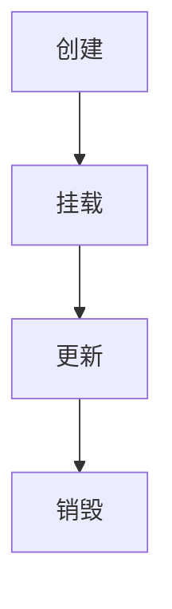

# [主题名称] Vue.js 学习笔记

> **学习目标**：[在这里描述本篇笔记的学习目标和要点]

---

## 📚 第一篇 | [篇章标题]

> **本篇概述**：[简要描述本篇内容覆盖的核心概念和知识点]

### 1.1 **[章节标题]**

#### 1.1.1 [小节标题]

##### 📖 基本概念

[概念解释内容]

- **关键术语 1**：定义和解释
- **关键术语 2**：定义和解释

##### 🔍 核心原理

[原理性内容讲解]

> 💡 **核心思想**：[提炼核心观点]

##### 📝 代码示例

**基础用法：**

```vue
<template>
  <!-- 模板代码 -->
</template>

<script setup>
// JavaScript 逻辑
</script>

<style scoped>
/* 样式代码 */
</style>
```

**进阶用法：**

```javascript
// 更复杂的实现代码
function exampleFunction() {
  // 具体实现
}
```

##### 📊 对比分析

| 特性   | 方案 A | 方案 B | 优劣分析 |
| ------ | ------ | ------ | -------- |
| 性能   | 高     | 中     | A 更优   |
| 易用性 | 中     | 高     | B 更优   |
| 维护性 | 高     | 中     | A 更优   |

##### ⚠️ 注意事项

- **重要提醒 1**：具体注意内容
- **重要提醒 2**：具体注意内容

##### 🎯 实际应用

```vue
<!-- 实际项目中的应用示例 -->
<template>
  <div class="example-component">
    <!-- 实际应用代码 -->
  </div>
</template>
```

#### 1.1.2 [小节标题]

##### 🔧 API 详解

**主要方法：**

- `method1(params)` - 方法描述
  - **参数**：参数说明
  - **返回值**：返回值说明
  - **示例**：使用示例

```javascript
// API 使用示例
const result = method1({
  param1: "value1",
  param2: "value2",
});
```

**配置选项：**

```javascript
const config = {
  option1: "default", // 选项1说明
  option2: true, // 选项2说明
  option3: {}, // 选项3说明
};
```

##### 🚀 性能优化

1. **优化策略 1**

   - 具体实现方法
   - 性能提升效果

2. **优化策略 2**
   - 具体实现方法
   - 适用场景分析

### 1.2 **[章节标题]**

#### 1.2.1 [小节标题]

##### 🌟 特性列表

- ✅ **特性 1**：详细描述
- ✅ **特性 2**：详细描述
- ⚠️ **限制 1**：限制描述
- ❌ **不支持**：不支持的功能

##### 📋 使用步骤

1. **第一步**：具体操作说明

   ```javascript
   // 步骤1的代码示例
   ```

2. **第二步**：具体操作说明

   ```javascript
   // 步骤2的代码示例
   ```

3. **第三步**：具体操作说明
   ```javascript
   // 步骤3的代码示例
   ```

##### 🎨 最佳实践

> 🎯 **实践建议**：[提供具体的实践建议]

**推荐写法：**

```vue
<template>
  <!-- 推荐的代码写法 -->
</template>
```

**不推荐写法：**

```vue
<template>
  <!-- 不推荐的代码写法 -->
</template>
```

**原因分析：**

- 推荐写法的优势
- 不推荐写法的问题

---

## 📚 第二篇 | [篇章标题]

### 2.1 **[章节标题]**

#### 2.1.1 [小节标题]

##### 🔄 生命周期



| 生命周期钩子  | 触发时机 | 主要用途 |
| ------------- | -------- | -------- |
| `onMounted`   | 挂载后   | DOM 操作 |
| `onUpdated`   | 更新后   | 响应变化 |
| `onUnmounted` | 卸载前   | 清理资源 |

##### 🧩 组件设计

**组件结构：**

```vue
<!-- ParentComponent.vue -->
<template>
  <div class="parent-component">
    <ChildComponent
      :prop1="value1"
      :prop2="value2"
      @custom-event="handleEvent"
    />
  </div>
</template>

<script setup>
import ChildComponent from "./ChildComponent.vue";

// 组件逻辑
const value1 = ref("");
const value2 = ref("");

const handleEvent = (payload) => {
  // 事件处理逻辑
};
</script>
```

**Props 设计：**

```javascript
// 类型定义
interface Props {
  prop1: string
  prop2?: number
  prop3: boolean
}

// 默认值
const props = withDefaults(defineProps<Props>(), {
  prop2: 0,
  prop3: false
})
```

---

## 🔧 工具函数与辅助方法

### 常用 Composables

```javascript
// useExample.js
import { ref, computed, onMounted } from "vue";

export function useExample() {
  const state = ref(null);

  const computedValue = computed(() => {
    // 计算逻辑
    return state.value?.processed;
  });

  const method = () => {
    // 方法实现
  };

  onMounted(() => {
    // 初始化逻辑
  });

  return {
    state,
    computedValue,
    method,
  };
}
```

---

## 📝 学习总结

### 🎯 核心要点

1. **要点 1**：[总结要点]
2. **要点 2**：[总结要点]
3. **要点 3**：[总结要点]

### 🤔 深入思考

- **问题 1**：[思考问题及分析]
- **问题 2**：[思考问题及分析]

### 📚 延伸阅读

- [文档链接 1](URL) - 相关文档
- [文章链接 2](URL) - 深入文章
- [视频教程 3](URL) - 视频资源

---

## 📋 TODO & 进度

### ✅ 已完成

- [x] 基础概念学习
- [x] 核心 API 掌握

### 🔄 学习中

- [ ] 高级特性探索
- [ ] 实际项目应用

### 📅 计划学习

- [ ] 源码深入分析
- [ ] 性能优化实践

---

> **学习笔记更新时间**：[YYYY-MM-DD]  
> **当前学习进度**：[XX%]  
> **下次学习重点**：[学习重点描述]
